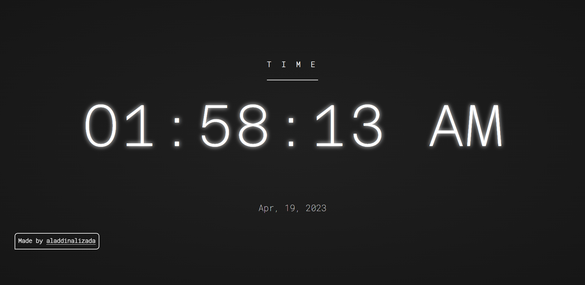

# Clock

The Clock application is a simple command-line tool that displays the current time and date in various formats. It is a useful utility for keeping track of time and date information in different time zones or for general timekeeping purposes. This README file provides an overview of the Clock application, instructions for installation, usage, and customization, and troubleshooting information.

# Features

- Displays the current time and date in various formats, including 12-hour and 24-hour format.
- Supports multiple time zones, allowing users to specify a specific time zone to display.
- Displays additional information, such as the day of the week and the time elapsed since the beginning of the day.
- Provides options for customization, including setting the time format, time zone, and display options.
- Lightweight and easy to use, with a simple command-line interface.
